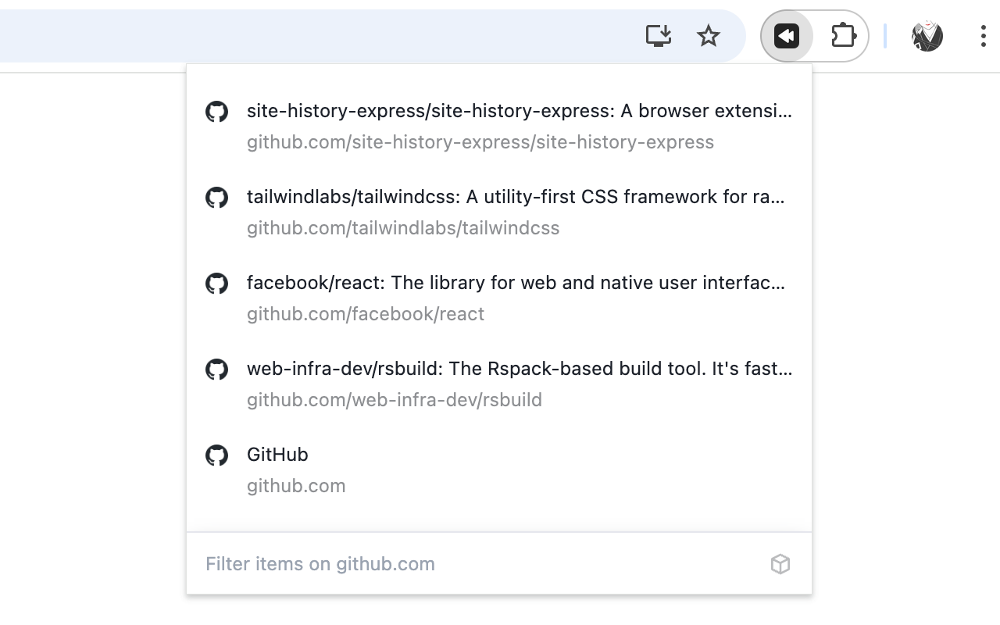

Site History Express is a handy browser extension that lets you quickly revisit pages you've recently viewed on the current website.

## Install

[](https://chrome.google.com/webstore/detail/aifnngnkjcdamfofbfldbnighkjkkmbp)
[](https://microsoftedge.microsoft.com/addons/detail/gkglkmigeofpfjmgajfekdnfhdpbccic)

## Features

When you're on a website, simply click the extension icon to view your browsing history for the current website. Pin the extension icon to your browser for quick and easy access! If you click the extension icon on a new tab, it will show your complete browsing history across all websites. Use keyword search to quickly find specific pages in your history.

Keyboard shortcuts for super-fast navigation:

- Previous: ArrowUp
- Next: ArrowDown
- Jump Up: Shift + ArrowUp
- Jump Down: Shift + ArrowDown
- Open: Enter
- Open in New Tab: Shift + Enter

Set a custom keyboard shortcut to instantly open your history:

1. Go to chrome://extensions/shortcuts
2. Find Site History Express
3. Set your shortcut (e.g., Ctrl + Shift + 8)

## Develop

This project's tech stack is React + Tailwind CSS, and it's built using Rsbuild. Here are the commands you'll need during development:

```bash
# dev
yarn dev

# build
yarn build
```
